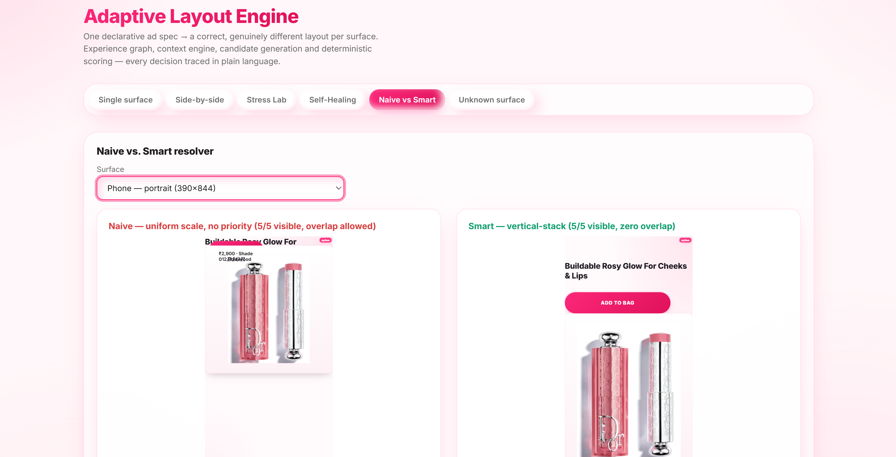

<div align="center">

# Adaptive Layout Engine

**A deterministic, constraint-based layout resolution engine for adaptive advertising.**

One declarative ad spec → a correct, context-aware layout for *any* surface — resolved, scored, and explained in real time.

[](https://www.typescriptlang.org/)
[](https://react.dev/)
[](https://vitejs.dev/)
[](#setup)
[](#feature-overview)
[](https://nodejs.org/)

<br/>



</div>

---

## What this is

Most "responsive ad" demos are one fixed layout with CSS breakpoints bolted on. This is a different
category of problem, solved a different way.

**Adaptive Layout Engine** takes one declarative ad specification — content and *intent*, with no
width, height, or position ever authored by hand — and resolves it into a genuinely different,
correct layout for each target surface: a phone in portrait, a broadcast lower-third, a retail
kiosk, a printed QR panel, or a surface nobody has seen before, typed in live during a demo.

Every resolution runs a real constraint-solving pipeline, not a lookup table or a set of media
queries:

1. **Experience Graph** — derives proximity/exclusion relationships between elements from their
   semantic roles alone (never from hardcoded element ids), so the same rule set generalizes to any
   spec.
2. **Context Engine** — normalizes a surface's real-world constraints (tap ergonomics, viewing
   distance, attention budget, aspect ratio) into qualitative flags with documented thresholds.
3. **Candidate generation** — five independent spatial strategies (vertical stack, horizontal
   split, grid, corner-anchored overlay, and an emergency last-resort fallback) each produce a
   complete, self-consistent layout through one shared placement engine.
4. **Deterministic scoring** — an **8-dimensional fitness function** scores every candidate
   (constraint compliance, priority preservation, visual balance, tap-target compliance, render
   cost, context fit, graph-proximity adjacency, and whole-composition cohesion), with a hard-fail
   rule that zeroes out any candidate that overlaps, clips, or drops a must-keep element — no matter
   how well it scores otherwise.
5. **Explainable resolution** — the winner isn't just chosen, it's *explained*: a full decision
   trace records why every element was shrunk, grown, or dropped, and why every losing strategy
   lost, in language a human wrote it to be read as.

The result degrades gracefully under real stress — verified, not assumed, against **200 randomized
adversarial surfaces per run, with zero hard-invariant violations, every single run** — and heals
itself when the input is malformed: broken image sources, absurdly long text, missing assets, or a
surface smaller than the content's own declared minimum size, all injected simultaneously.

For the full technical design, see [ARCHITECTURE.md](ARCHITECTURE.md). For a from-scratch,
adversarial internal audit of the project's own output quality — with measured before/after
numbers, not self-reported claims — see [PHASE8-AUDIT.md](PHASE8-AUDIT.md).

## At a glance

| | |
|---|---|
| **Resolution strategies** | 5 — vertical-stack, horizontal-split, grid, overlay-safe-margins, emergency-fit |
| **Scoring dimensions** | 8 independently-weighted sub-scores + a hard-fail invariant rule |
| **Test suite** | 144 tests across 11 suites · `tsc --noEmit` strict mode, zero `any` |
| **Stress testing** | 200 randomized adversarial surfaces per run · **0 failed, every run** |
| **Self-healing** | Recovers from broken images, missing assets, absurd text length, and undersized surfaces — simultaneously |
| **Live surfaces** | 5 built-in (phone / TV / kiosk / print) + unlimited via live "unknown surface" input |
| **Explainability** | Every shrink, grow, drop, win, and loss traced in plain language — not just logged |

**Contents:** [What this is](#what-this-is) · [At a glance](#at-a-glance) · [Setup](#setup) ·
[Running the demo](#running-the-demo) · [Feature overview](#feature-overview) ·
[Known limitations](#known-limitations) · [Time spent](#time-spent) ·
[AI tool disclosure](#ai-tool-disclosure) · [Live demo](#live-demo) ·
[Bonus points](#bonus-points) · [Project layout](#project-layout)

---

## Setup

Requires Node 18+.

```bash
npm install       # install dependencies
npm run dev       # start the Vite dev server (http://localhost:5173)
npm run test      # run the full Vitest suite (144 tests)
npm run build     # type-check (tsc --noEmit) + production build to dist/
npm run preview   # serve the production build locally (http://localhost:4173)
```

`npm run typecheck` runs `tsc --noEmit` on its own.

---

## Running the demo

Start `npm run dev` (or `npm run build && npm run preview` for the production
build) and open the page. A top nav bar switches between views:

- **Single surface** — the default view. Use the **surface picker** dropdown to
  switch between the 5 sample surfaces (plus a pre-shrunk 70×70 kiosk). The
  resolved layout renders at true aspect ratio, scaled to fit. Below the header
  you see the winning strategy, how many elements stayed visible, and the derived
  context flags (aspect / attention / touch / far).
  - **Device frame** dropdown (Auto / Clean / Phone / TV) wraps the same
    `SurfaceStage` render in a realistic chassis — Auto picks by aspect ratio
    alone (never a surface-id lookup). **TV** pillarboxes any surface narrower
    than a real TV's own landscape shape (dark bars either side) instead of
    shrink-wrapping the chassis into an un-TV-like tall column.
  - **Debug: on/off** overlays a dashed safe-area outline plus a colored,
    labeled bounding box per element — green border for placed-as-wanted,
    amber for shrunk — reusing the exact strings the Layout Debugger panel
    already shows.
- **Degradation slider** — sits directly under the single-surface layout. Two
  sliders live-shrink the selected surface's width and height; the **real**
  resolver re-runs on every change, so you watch elements shrink and then drop in
  priority order (e.g. 5/5 → 4/5 → 2/5 as the print panel goes from 620×874 down
  to 240×200). **Fluid Stress Test** (button next to the slider heading)
  automates the same thing — an out-of-phase sin/cos oscillation continuously
  sweeps width and height through a full range of aspect ratios so you can
  watch the resolver re-adapt every frame without dragging anything.
- **Explainability panels** (under the single-surface view, updating live on
  every surface change):
  - **Layout Debugger** — the per-element decision trace ("headline: wanted
    420×96, placed at 390×96 → shrunk 7%", "logo: dropped — priority 5, no room
    left…").
  - **Layout Counterfactuals** — every candidate strategy with its score, winner
    badged "CHOSEN"; click a losing strategy to see a generated sentence naming
    the sub-score it lost on and by how many points.
  - **Layout Health Check** — a pass / warn / fail checklist derived from the
    winning candidate's eight sub-scores (including `contextFit`,
    `adjacencyFit`, and `compositionCohesion`).
- **Side-by-side (5.3)** — all 5 sample surfaces resolved at once, each in a
  plain device-style frame, each the real resolved layout (not a mockup). The
  fastest way to see that the layouts genuinely differ.
- **Stress Lab (5.1)** — click **Run Stress Test** to generate 200 randomized
  surfaces (dimensions from 100×600 to 3840×2160, random constraint mixes), run
  the real pipeline against every one, and report passed / degraded / failed
  counts plus a robustness percentage. A **Conclusion** section buckets every
  degraded/failed entry by root cause (not just count) — see
  [ARCHITECTURE.md §8](ARCHITECTURE.md#8-stress-test-methodology--results) —
  and each row below it is tagged with the same category. Click any entry to
  load that exact surface into the single-surface view for inspection with the
  panels above.
- **Self-Healing (5.2)** — click **Load broken scenario** to run a deliberately
  adversarial spec (absurdly long headline, invalid hero image src, missing logo
  src, tiny 240×260 touch surface, optional longer German CTA). Shows the naive
  attempt beside the recovered layout, a brief "re-optimizing" beat, and the
  Debugger panel listing the shrink / drop / placeholder decisions. The CTA stays
  visible through all of it.
- **Naive vs Smart (5.4)** — the same spec and surface run through a deliberately
  dumb resolver (one uniform scale factor, diagonal stagger, overlap allowed, no
  priority logic) on the left and the real resolver on the right. On a
  constrained surface the naive side visibly overlaps and shrinks elements into
  illegibility; the smart side keeps a clean priority-ordered layout. Pick the
  surface with the dropdown.
- **Unknown surface (5.5)** — a form for width, height, minTapTarget, touchOnly,
  viewingDistance, attentionWindow. On submit it calls the same `defineSurface()`
  used by every built-in surface (so Phase 1 validation runs for real) and
  resolves through the exact same pipeline — no new code path. Enter an invalid
  combination (touchOnly with no minTapTarget) and the real validation error is
  shown verbatim, not swallowed — including a genuinely non-numeric value
  (e.g. leaving width as text): the message names the value `NaN`, not the
  misleading `null` that `JSON.stringify(NaN)` used to produce. Enter a
  surface too small for even the top-priority element (try `10000×20`) and
  the view now explains it plainly — a callout naming the fallback, plus the
  same Layout Debugger panel used everywhere else, listing exactly why each
  element was dropped — instead of a bare "0/5 visible" with no context.

---

## Feature overview

The "Addresses" column maps each feature to the official Flam evaluation
criteria — **Constraint resolution algorithm (35%)**, **Layout correctness
across surfaces (25%)**, **TypeScript & architecture (20%)**, **Example
application (10%)**, **Code quality (10%)** — and to the internal project-plan
feature numbers (`§4.x`).

| Feature | What it does | Addresses |
|---|---|---|
| Typed spec / surface models (`defineAd`, `defineSurface`) | Closed unions for roles and element types; construction-time validation with named, field-specific errors; an invalid role literal is a compile error | TypeScript & architecture (20%); core req: "compile-time or clearly-reported runtime type errors" |
| Experience Graph (`buildGraph`) | Derives proximity/exclusion edges from role semantics with a deterministic, id-agnostic rule set | Constraint resolution algorithm (35%); §4.1 semantic layout graph |
| Importance / survival tiers | `importance` (`critical`/`should-survive`/`nice-to-have`) + `visibility` (`always`/`degradable`/`decorative-only`) layered on numeric priority | Constraint resolution algorithm (35%); §4.2 |
| Context Engine (`resolveContext`) | Normalizes surface constraints (aspect, touch, far-viewing, attention budget, audio, motion) into qualitative flags with documented thresholds | Constraint resolution algorithm (35%); §4.3-context |
| Context-aware sizing + strategy bias | Far-viewing text/buttons and touch-surface CTAs request genuinely bigger sizes (§4.3-context); a `contextFit` sub-score rewards the strategy whose geometry matches the surface's aspect ratio and rewards fewer visible elements under a short attention budget or far viewing | Constraint resolution algorithm (35%); §4.3-context, §4.14 |
| Candidate generation (5 strategies) | vertical-stack / horizontal-split / grid / overlay-safe-margins / emergency-fit, all through one shared priority-ordered placement engine | Constraint resolution algorithm (35%); Layout correctness (25%); §4.3 |
| Deterministic fitness scoring | 8 weighted sub-scores + hard-fail-to-0 rule for overlap / out-of-bounds / dropped-always / priority-inversion; pure function | Constraint resolution algorithm (35%); Code quality (10%); §4.3 |
| Performance-aware scoring term | `renderCost` sub-score (element count + mean size) breaks near-ties toward cheaper-to-render layouts | Constraint resolution algorithm (35%); §4.9 |
| Lightweight declarative constraints | safeArea, `minSize`, `minTapTarget`, `brandRules.locked` are declared on the spec/surface and read by the scorer — not hardcoded in the resolver | TypeScript & architecture (20%); §4.4 / §4.6 |
| Priority degradation cascade | Shrink toward minSize, then drop lowest-priority-first in a strict monotone cascade; `visibility:"always"` elements never dropped | Constraint resolution algorithm (35%); core req: "priority-based degradation, not overlap/clip"; §4.5 |
| Grow into slack | Elements can size up to 1.4× their preferred size on a strategy's "free" axis when a surface offers genuine extra room, not just shrink to fit less; brand-locked elements exempt | Constraint resolution algorithm (35%); Layout correctness (25%); §4c |
| Emergency-fit strategy | A 5th candidate that relaxes `visibility:"always"` elements' minSize to a 24×16 floor before placing — the only strategy that can still seat the must-keep elements when a surface is smaller than every element's declared minimum; wins only when the other 4 strategies all hard-fail to 0 | Constraint resolution algorithm (35%); Layout correctness (25%); §4d |
| Decision trace + Layout Debugger panel | Per-element plain-language reasoning ("shrunk 7%", "grew 40%", "dropped — priority 5…") updating live on surface change | Code quality (10%); §4.7 |
| Layout Counterfactuals panel | Every candidate + score; click a loser for a generated sentence naming the sub-score gap (`explainLoss`) | Code quality (10%); §4.7b |
| Layout Health Check panel | Pass/warn/fail checklist derived from the same 8 sub-scores | Code quality (10%); Example application (10%); §4.7c |
| Side-by-side multi-surface view | All 5 surfaces resolved and rendered at once in device-style frames | Layout correctness across surfaces (25%); §4.16 |
| Stress Lab | 200 randomized surfaces incl. extremes; tiered pass/degraded/failed; **0 failed every run**; ~82.5% robustness, remaining degraded band is 100% "sparse but valid" (no nothing-fits / always-element-dropped cases left) | Layout correctness across surfaces (25%); §4.10 |
| Adjacency-fit sub-score | Wires the Experience Graph's "proximity" edges (e.g. price ↔ its call-to-action) into scoring — a sub-score rewards a candidate for keeping graph-linked pairs spatially close instead of leaving the graph's relational data unused | Constraint resolution algorithm (35%); §4e |
| Composition-cohesion sub-score | Judges the WHOLE visible ad together (not just one declared pair) — heavily rewards a composition where every element's content fills its own shared footprint, heavily penalizes elements scattered into separate corners with a dead void between them. The heaviest-weighted "which arrangement is best" sub-score; on live testing it was the fix that stopped `overlay-safe-margins`'s scattered-corners layout from winning at all | Constraint resolution algorithm (35%); Layout correctness (25%); §4g |
| Self-healing demo | Recovers from long text + broken images + tiny surface + translated copy simultaneously | Layout correctness (25%); §4.13; official bonus "text-measurement-aware layout" |
| Real text measurement (`text-measure.ts`) | Canvas `measureText()` for the true rendered width of long / translated strings; node fallback preserves ordering | Constraint resolution algorithm (35%); official bonus "text-measurement-aware layout"; §4.13 / §4.17 |
| Naive-vs-smart comparison | The real output beside a deliberately dumb uniform-scaling resolver | Example application (10%); §4.19 (proves it is not "uniform scaling passed off as adaptation") |
| Degradation slider | Live re-resolve as the surface shrinks; watch shrink→drop in order | Example application (10%); §4.18 |
| Fluid Stress Test | Continuous out-of-phase sin/cos oscillation of width/height, sweeping every aspect ratio automatically instead of manual dragging | Example application (10%); Layout correctness (25%) |
| Device frame (Auto/Clean/Phone/TV) | Wraps the same renderer in a realistic chassis, picked by aspect ratio alone; the TV chassis fits a landscape box within the caller's layout budget first, then fits real content inside it, so it never balloons past the available space — non-landscape content is pillarboxed and explicitly labeled rather than distorting the chassis shape | Example application (10%) |
| Layout Debugger overlay ("DevTools for Ads") | Toggle-able safe-area outline + per-element zone/shrink bounding boxes drawn in the exact same transformed coordinate space as the real elements | Code quality (10%); §4.7 |
| Live unknown-surface input | Type a brand-new surface, resolve it through the identical pipeline; real validation errors shown verbatim | TypeScript & architecture (20%); Example application (10%); §4.20 (live-interview bonus rehearsal) |

---

## Known limitations

Real, specific to what was built (more technical depth in
[ARCHITECTURE.md §10](ARCHITECTURE.md#10-limitations--what-id-improve-with-more-time)):

- **`contextFit`'s bonus/penalty sizes are reasoned, not tuned.** Context now
  genuinely changes element sizing (far-viewing text, touch CTAs) and which
  strategy wins (a `contextFit` sub-score rewards aspect-matched strategies and
  fewer visible elements under a short attention budget or far viewing) — see
  [ARCHITECTURE.md §4](ARCHITECTURE.md#4-candidate-generation--scoring). The
  exact magnitudes (`+20`/`−15` shape bonuses, `1.3×`/`1.15×` size scales) are
  hand-chosen constants, not calibrated against real ad performance data.
- **Candidate generation is 5 fixed strategies, not an exhaustive search.** No
  parameter sweep, no packing algorithm, no refinement of the winner.
  `contextFit` picks the best-suited of the four normal strategies;
  `emergency-fit` (the 5th) only ever wins when all four hard-fail to 0 — it
  isn't a smarter layout, it's a documented last resort that relaxes
  always-visible elements' minSize to a 24×16 floor so something real still
  renders instead of nothing. On some mid-size surfaces the best of four is
  only adequate — that is the remaining "degraded" band in the Stress Lab.
- **The Stress Lab "robustness" number (~82.5%) is a quality bar, not a
  correctness bar.** "passed" means score ≥ 70. Hard-invariant safety (no
  overlap / clip / dropped-always, ever) held on 100% of surfaces in every run;
  "failed" is always 0. The headline percentage understates correctness: since
  `emergency-fit` was added, every remaining degraded entry is categorized
  "sparse but valid" — a genuinely non-overlapping, in-bounds layout with every
  must-keep element intact, just visually sparse on a surface too small for
  the full ad (`320×50`, `100×600`, `120×2000`, …). There are no more
  "nothing fits" or "always-element dropped" entries in the degraded band —
  see ARCHITECTURE.md §4, "Context-aware sizing", §4d, "Emergency-fit", §4e,
  "adjacencyFit", and §4g, "compositionCohesion", for the full sequence of
  fixes that moved this number from ~65% → ~87% → ~90% → ~84% → the current
  ~82.5%, and shifted every remaining failure mode from "ad disappears" to
  "ad is honestly sparse." The last move (§4g) was not just a quality-bar
  shuffle — it fixed a real bug where `overlay-safe-margins`'s
  scattered-corners arrangement (elements pinned to separate corners with a
  dead void between them, not reading as one connected ad) kept winning
  despite clean constraint/priority numbers; `compositionCohesion` judges the
  whole visible ad together and now stops that arrangement from winning on
  any of the 5 sample surfaces, which also happened to keep more elements
  visible and raise robustness as a side effect. `failed` is still 0 in every
  run.
- **Text measurement uses the Canvas `measureText()` API**, which differs
  slightly from the browser's final text layout (kerning, font fallback,
  wrapping). In the Node test environment there is no canvas, so a linear
  approximation (`length × fontSize × 0.52`) is used — it preserves ordering, not
  absolute pixels.
- **`alignment` edges are typed but never derived**; only proximity and exclusion
  edges are built, and no strategy reads edge data for placement yet.
- **One renderer only.** `ResolvedLayout` is renderer-agnostic data and
  `render-dom.ts` is a deliberate stub, but the only implemented
  `ResolvedLayout → pixels` path is `SurfaceStage.tsx` (React DOM). No Canvas
  renderer was built, so the renderer-agnostic claim is sound by construction but
  undemonstrated.
- **`overlay-safe-margins` caps at 4 elements** (four corners) and always drops
  the 5th, so it rarely wins on the 5-element sample ad.
- **One sample product, code-defined.** The ad is a single real product (DIOR
  Backstage Rosy Glow Stick — 012 Rosewood, styled as a Nykaa PDP ad, real
  headline/price/CTA copy, a real product photo) — not a live catalog. Text
  elements render their actual `text` at a font size fit to whatever box the
  resolver placed them in (`SurfaceStage`'s `fitFontSize`, reusing the same
  `measureTextBlock` the resolver already computes with); specs that declare no
  `text` still fall back to the id/role/size debug label.

---

## Time spent

Built across seven specified phases (`phase1.md`–`phase7.md`), plus a
from-scratch adversarial audit round (see [PHASE8-AUDIT.md](PHASE8-AUDIT.md))
that found and fixed three additional real bugs after the phases were
"complete" — including one severe enough to invert the ad's entire visual
hierarchy under real-world constraints. <!-- update this line with your actual total time before publishing -->

---

## AI tool disclosure

Claude Code (Anthropic) was used throughout implementation. Development ran in
seven explicitly specified phases (`phase1.md`–`phase7.md` in this repo); at
each phase a human wrote the specification, reviewed the generated code, ran
the tests and the browser checks, and only then moved to the next phase. No
phase was accepted without its acceptance criteria being met. A further,
unscripted audit round — the author acting as a deliberately strict reviewer
of the live application, not the code — found and drove the fixes documented
in [PHASE8-AUDIT.md](PHASE8-AUDIT.md). The author has read the entire codebase
and can explain and defend every part of it — the type design, the
edge-derivation rules, the scoring weights and hard-fail rule, the degradation
cascade, and the stress/self-healing methodology.

---

## Live demo

Not yet deployed.

Locally: `npm run build && npm run preview` → http://localhost:4173

---

## Bonus points

Where the feature table above maps to the grading rubric, this one maps to the
project plan's own differentiator list (`§4.x`) and gives a verdict for each —
**Implemented**, **Partial** (the mechanism exists but is not fully wired
through), or **Skipped**.

| # | Feature | Status | Notes |
|---|---|---|---|
| 4.1 | Semantic layout graph (typed relational edges) | **Implemented** | proximity + exclusion edges derived from roles; `alignment` typed but not derived; proximity edges now read by scoring's `adjacencyFit` sub-score (§4e) — not yet by placement itself |
| 4.2 | Importance / survival tiers | **Implemented** | `importance` + `visibility` unions; `visibility:"always"` enforced as a hard-fail in scoring |
| 4.3 | Candidate generation + deterministic fitness scoring | **Implemented** | 5 strategies (4 context-suited + `emergency-fit` last-resort), 8 weighted sub-scores (incl. `adjacencyFit` §4e and `compositionCohesion` §4g), hard-fail rule, determinism test |
| 4.3-context | Context-aware adaptation | **Implemented** | far-viewing inflates text/button preferred size, touch inflates the clickable CTA (candidates.ts); a `contextFit` sub-score rewards the aspect-matched strategy and fewer visible elements under short attention / far viewing (scoring.ts) — composition strategy itself changes, not just sizes (verified: broadcastLowerThird's winner flips from `grid` to `horizontal-split`) |
| 4.4 | Lightweight declarative constraint rules | **Implemented** | safeArea / minSize / minTapTarget / brandRules read by the scorer, declared on spec+surface |
| 4.5 | Graceful degradation engine | **Implemented** | strict priority-monotone shrink→drop cascade; documented in ARCHITECTURE §5 |
| 4.6 | Brand-safe adaptation | **Partial** | `brandRules.locked` + brand `minSize` are honoured as a `constraintViolations` penalty; not every advertiser rule from the plan (e.g. `product.mustStayDominant`, `headline.canWrapNotTruncate`) is modelled |
| 4.7 | Layout Debugger | **Implemented** | live per-element decision-trace panel |
| 4.7b | Layout Counterfactuals | **Implemented** | click a losing candidate → `explainLoss()` names the largest sub-score gap and the point delta |
| 4.7c | Layout Health Check | **Implemented** | pass/warn/fail checklist on the 8 sub-scores, incl. "Element grouping" (`adjacencyFit`) and "Ad cohesion" (`compositionCohesion`) |
| 4.9 | Performance-aware composition | **Implemented** | `renderCost` sub-score (weight 0.06) as a tie-breaker inside the same fitness function |
| 4.10 | Automated stress testing ("Stress Lab") | **Implemented** | 200 randomized surfaces, tiered pass/degraded/failed, click-through inspection; 0 failed every run; robustness moved ~50% → ~65% (`contextFit`) → ~87% (fixing a minTapTarget-sizing bug) → ~90% (`emergency-fit`) → ~84% (`adjacencyFit`, §4e — a quality-bar dip from re-weighting) → ~82.5% (`compositionCohesion`, §4g — fixed `overlay-safe-margins`'s scattered-corners layout winning at all, which also raised robustness); still 0 failed, still 100% "sparse but valid" in the degraded band |
| 4.13 | Self-healing / fault-tolerant layout (combined stressors) | **Implemented** | long headline + invalid hero src + missing logo src + tiny surface + longer German CTA, all at once; recovers with CTA kept (now via `grid`, 4/4 visible — `contextFit`'s square-aspect bonus improved on the pre-fix `vertical-stack`, 3/4 visible) |
| 4.14 | Interactive vs. passive layout strategy | **Implemented** | touch surfaces get a genuinely bigger CTA (candidates.ts sizing) and `contextFit` penalizes `overlay-safe-margins` (corner-spread targets) under touch; far-viewing/short-attention surfaces reward strategies that keep fewer, larger elements visible |
| 4.16 | Side-by-side multi-surface view | **Implemented** | all 5 surfaces at once in phone/wide/square frames, each a real resolved layout |
| 4.17 | Language-aware adaptation | **Implemented** (scoped) | self-healing demo has an EN/DE locale toggle; the longer German CTA is measured and re-resolved rather than overflowing |
| 4.18 | Live degradation slider | **Implemented** | width/height sliders re-run the real resolver on every change |
| 4.19 | Naive vs. smart comparison view | **Implemented** | real resolver vs. uniform-scaling baseline, side by side, per surface |
| 4.20 | Live "unknown surface" input | **Implemented** | form → `defineSurface()` → identical pipeline; invalid combos surface the real error |
| 4.21 | Canvas renderer (second backend) | **Skipped** | `ResolvedLayout` is renderer-agnostic data and `render-dom.ts` is a stub seam, but no Canvas backend and no DOM/Canvas toggle were built. The renderer-swap claim is sound by construction, not demonstrated |
| Pillar A note | Optional AI Semantic Parser | **Skipped** (by design) | roles/priority are authored manually in the spec; no AI in the ingestion or decision path |

Official bonus points called out in the brief:

- **"text-measurement-aware layout"** — **Implemented** (`text-measure.ts`, used
  by candidate placement and exercised by the self-healing + language demos).
- **"add a new renderer without touching the resolution algorithm"** —
  **Structurally supported, not demonstrated** (no Canvas renderer built; see
  4.21).
- **"resolve an unseen surface live in the interview"** — **Implemented**
  (Unknown-surface view; verified in the regression sweep with a 2600×360
  surface).
- **Graceful failure on a mathematically unsatisfiable surface** —
  **Implemented** (`resolver.test.ts`, §7.3): a surface smaller on both
  axes than even `emergency-fit`'s last-resort floor (24×16) is run through
  the full `buildGraph → resolveContext → resolveLayout` pipeline; it never
  throws, every one of the five candidates hard-fails to `overall: 0`, and
  the returned layout has zero visible elements rather than an
  overlapping/out-of-bounds one — closing the one gap flagged against sibling
  implementations of this brief.

---

## Project layout

```
src/
  core/
    spec.ts                  ad spec types + defineAd()
    surfaces.ts              surface profile types + defineSurface()
    sample-data.ts           1 sample ad + 5 sample surfaces
    graph.ts                 Experience Graph (buildGraph, getRelatedNodes)
    context.ts               Context Engine (resolveContext)
    candidates.ts            5 candidate strategies (incl. emergency-fit) + shared placement engine
    scoring.ts               deterministic fitness scoring (scoreCandidate)
    resolver.ts              orchestration: generate → score → pick → trace
    trace.ts                 DecisionTrace + explainLoss()
    text-measure.ts          Canvas measureText() with node fallback
    naive-resolver.ts        deliberately dumb baseline (5.4)
    stress-lab.ts            generateRandomSurfaces + runStressTest + categorizeStressDetail (5.1)
    self-healing-scenario.ts adversarial spec + tiny surface (5.2)
    render-dom.ts            deliberate stub (framework-agnostic renderer seam)
    spec.invalid-example.ts.txt   compile-error demonstration (excluded from build)
    __tests__/               11 Vitest suites, 144 tests
  components/
    SurfaceStage.tsx         the one ResolvedLayout → pixels renderer
    DeviceFrame.tsx          phone/TV/clean device chassis wrapper (presentation only)
    LayoutDebugger.tsx       explainability panel 1
    LayoutCounterfactuals.tsx explainability panel 2
    LayoutHealthCheck.tsx    explainability panel 3
    StressLab.tsx MultiSurfaceView.tsx SelfHealingDemo.tsx
    NaiveVsSmart.tsx DegradationSlider.tsx UnknownSurfaceInput.tsx
    useCountUp.ts             presentation-only number animation hook
  styles/
    theme.css                design system — glassmorphism + claymorphism,
                              Nykaa-branded (hot-pink accent, white cards),
                              light only, prefers-reduced-motion aware
  App.tsx main.tsx
phase1.md … phase7.md        the phase specifications this was built against
ARCHITECTURE.md               full technical design
PHASE8-AUDIT.md                a from-scratch, adversarial audit of the live app
```

The UI is a presentation layer only: all styling lives in `styles/theme.css`
plus `className`s on component wrappers. No `src/core/**` file is imported by a
style concern, and the resolver output is unchanged. The site is styled to
match Nykaa's identity throughout (nav, buttons, cards, the ad canvas itself)
— one light theme, no dark mode or toggle.
